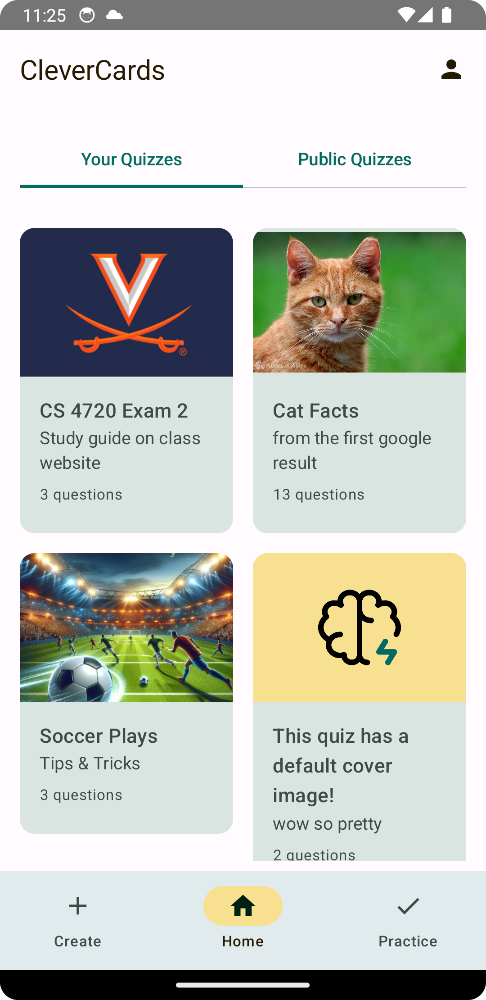
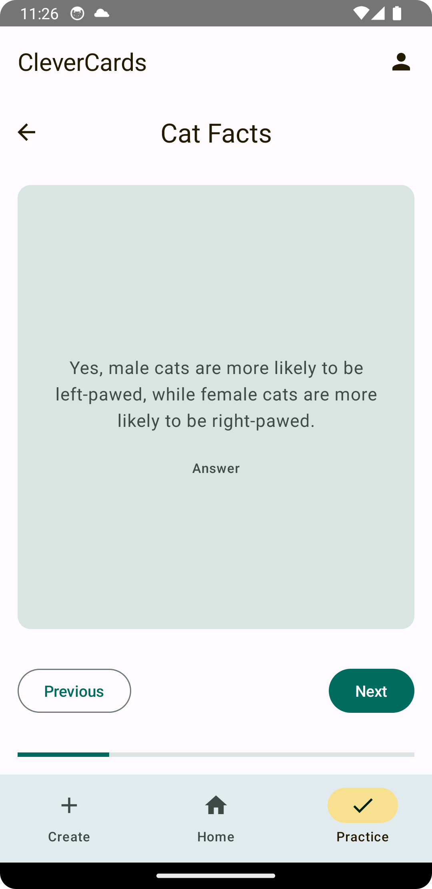
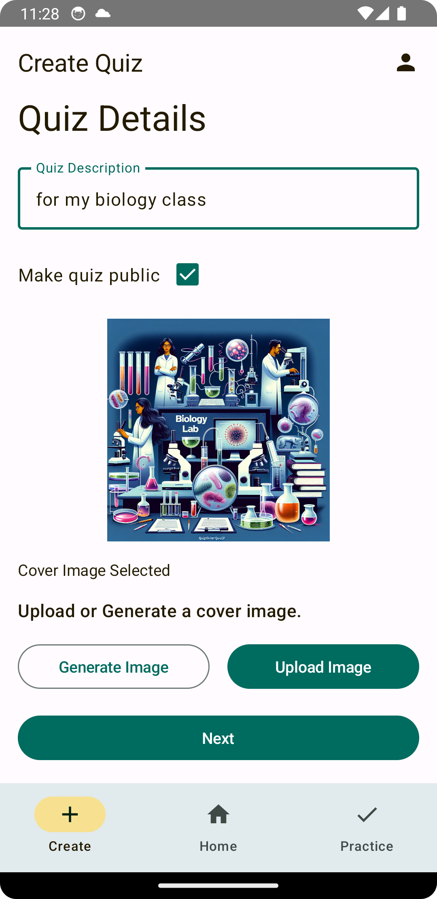
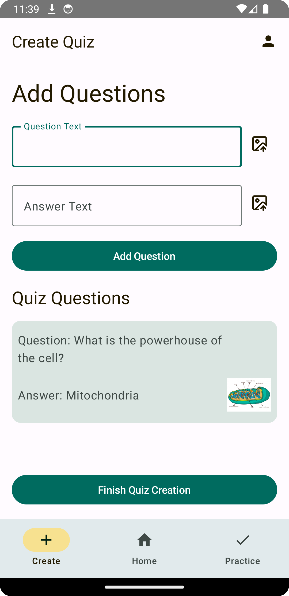

# CleverCards

CleverCards is a simple flashcard application. It is designed to help users learn and memorize information more effectively. The application allows users to create, edit, and delete flashcards, as well as quiz themselves on the flashcards they have created.

## App Screenshots

  

    
    
    
    
  

## Features
- Login with Google or email/password (using Firebase Authentication)
- Create flashcard decks
  - Decks can have a title, description, and be set to public or private
  - Decks can have a cover image that can be generated by OpenAI's DALL·E 3 or uploaded from the user's device
  - Flashcards can have question text, answer text, and images for both the question and answer
- Practice flashcard decks
  - Practice mode allows users to flip through flashcards
  - Users can see their recently practiced decks
- Home Page
  - Shows a grid of user's decks and all public decks

## Technologies Used
- Jetpack Compose
  - Material 3
- Firebase
  - Authentication
  - Firestore
  - Cloud Storage
- OpenAI API
  - DALL·E 3
- Coil
  - Image loading

## Roadmap (if I had more time)
- Add 'create new quiz' card to home page at end of quiz grid, or if there is no quiz grid, first on the page.
- Show a success snackbar message on the home page when a quiz is created. add a button to practice that quiz on the snackbar message.
- Handle all errors better
- Success snackbar on quiz creation

## Known Issues
- Error snackbars on 'Create' tab are not dismissible
- Image generation is a little slow (api limitation)
- Image generation might yield generic images if request breaks OpenAI TOS
- Navigation is a little buggy when going from Create to Home and Practice to Home. Takes two taps.